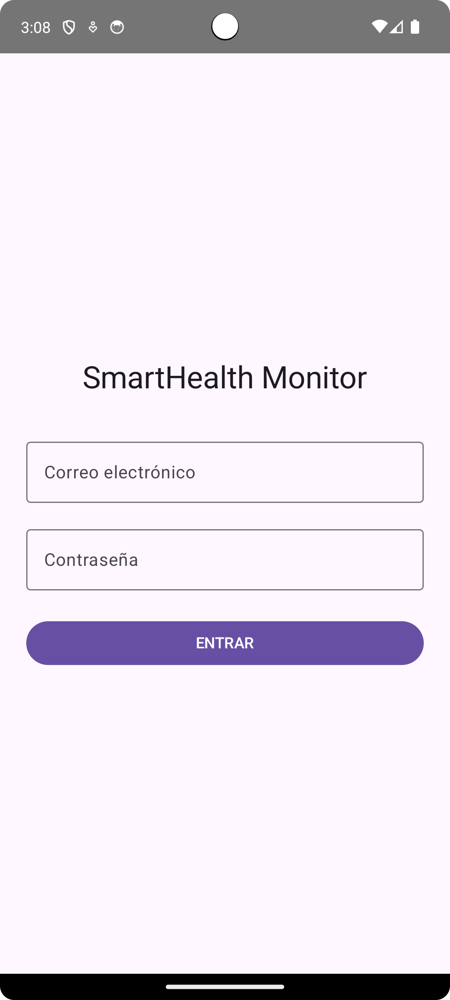
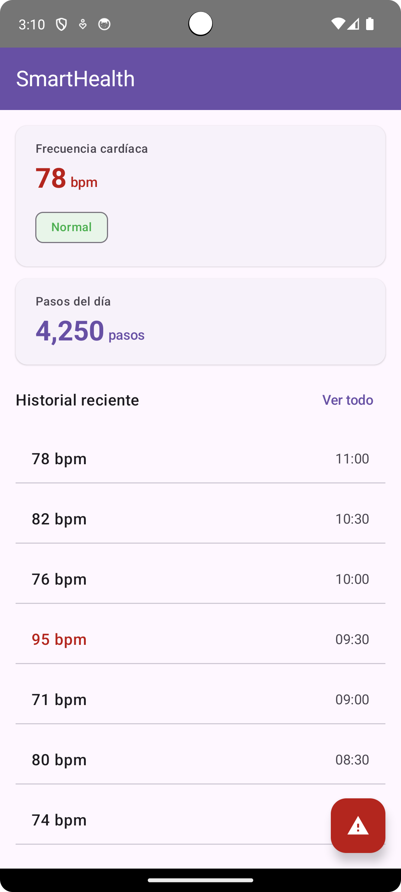
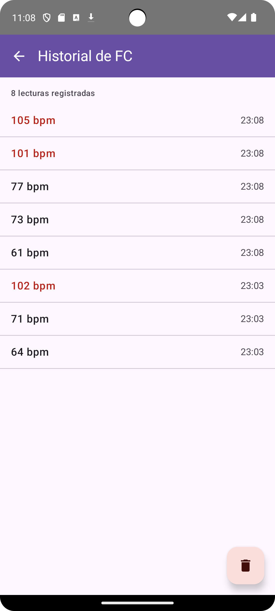
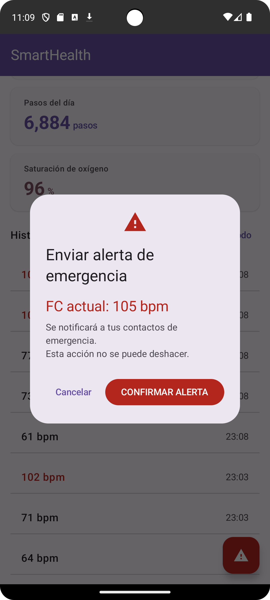
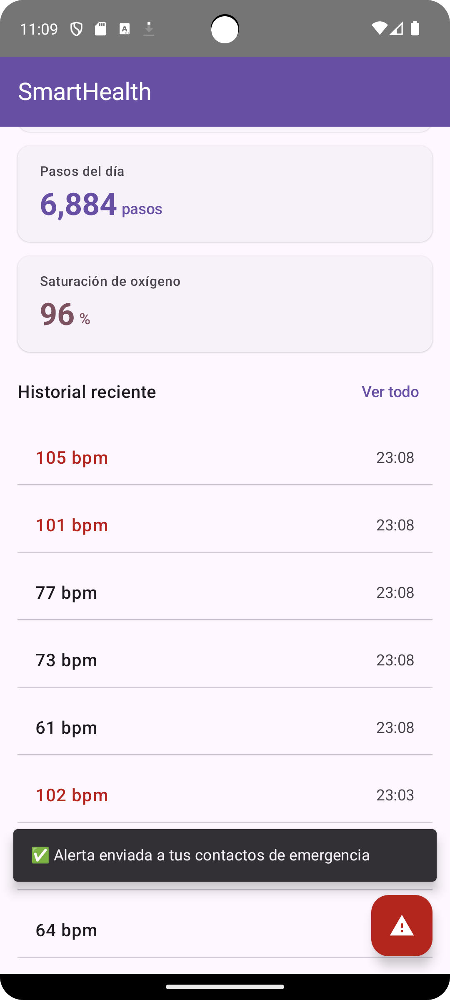

# SmartHealth Monitor


Aplicación Android multiplataforma para monitoreo de salud personal.

Desarrollada como proyecto integrador en UTNG — 9° Cuatrimestre 2025.

## Stack tecnológico

- Kotlin + Jetpack Compose
- Material Design 3
- Wearable Data Layer API (Wear OS)
- Health Services API (sensor FC real en segundo plano)
- Room Database (historial persistente offline)
- Jetpack Navigation + StateFlow
- Android TV / Leanback + Media3 (próximas unidades)
- Wear Compose Material (componentes visuales para Wear OS)
- Horologist (Rotary Input para Wear OS)
- Wearable Data Layer API (comunicación teléfono-reloj)
- Health Services API (sensor FC real en segundo plano)

## Pantallas implementadas (Unidad I)

- [x] LoginScreen — S4
- [x] DashboardScreen — S5
- [x] HistorialScreen — S7 (Room + persistencia local con Flow)
- [x] AlertaScreen — S8 (AlertDialog MD3 + Snackbar de confirmación)

## Pantallas implementadas (Unidad II - Wear OS)

- [x] WearDashboardScreen — S9 (FC grande con ScalingLazyColumn)
- [x] WearAlertaScreen — S9 (botones circulares ✓ / ✗)
- [x] WearHistorialScreen — S10 (Rotary Input con corona del reloj)
- [x] SmartHealthWatchFace — S10 (WatchFace personalizado con hora y FC)


## Pantallas implementadas (Unidad II - Wear OS)

- [x] TvCatalogScreen — S11 (Compose for TV con D-pad)
- [x] TvDetailScreen — S12 (Detalle con botones de acción)
- [x] TvPlaybackScreen — S12 (ExoPlayer con AndroidView)
- [ ] CastButton — S13 (Chromecast Remote Playback)


## Arquitectura - SmartHealth Monitor

```text
Sensor PPG (Wear OS)
│
├── Health Services API
│
▼
PassiveListenerService (Wear)
│
├── MessageClient (BLE)
│
▼
WearListenerService (App)
│
├── SmartHealthRepository
│
├── StateFlow<Int> (fcActual)
│   ├── DashboardViewModel (App)
│   │   └── DashboardScreen (Compose)
│   │       └── CastButton
│   │           └── Chromecast (Remote Playback)
│   │
│   └── TvViewModel (TV)
│       └── TvCatalogScreen (Compose TV)
│
└── Room Database (LecturaFC)
    │
    └── Repository
        │
        └── Flow<List<LecturaFC>>
            ├── HistorialScreen (App)
            └── TvCatalogScreen (TV)
```

## Capturas de pantalla

<div align="center">
  <table>
    <tr>
      <td align="center"><b>Login</b><br/></td>
      <td align="center"><b>Dashboard</b><br/></td>
    </tr>
    <tr>
      <td align="center"><b>Historial</b><br/></td>
      <td align="center"><b>Alerta (diálogo)</b><br/></td>
    </tr>
  </table>
</div>

### Snackbar de confirmación

<div align="center">
  
</div>

## Flujo completo de la app (v1.2.0)

### Teléfono
1. **Login** → Autenticación básica con validación
2. **Dashboard** → Frecuencia cardíaca y pasos en tiempo real
3. **Historial** → Lecturas guardadas en Room, persisten al cerrar la app
4. **Alerta** → Botón flotante rojo → Diálogo MD3 → Confirmación → Snackbar

### Wear OS
1. **WearDashboard** → FC grande + chips de navegación
2. **WearAlerta** → Botones circulares (✓ / ✗)
3. **WearHistorial** → Lista con scroll por corona (Rotary Input)
4. **WatchFace** → Carátula con hora y FC (seleccionable desde Settings)

## Autor

Princes Rocio Guerrero Sánchez — UTNG — princesgro@utng.edu.mx
